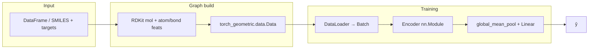
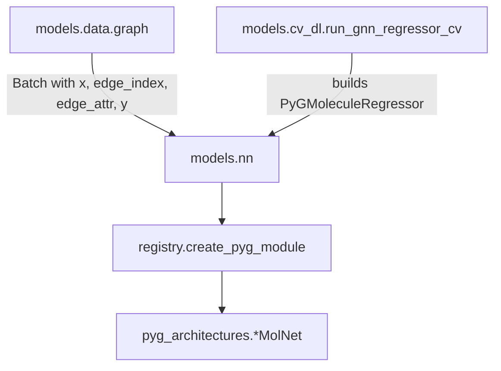
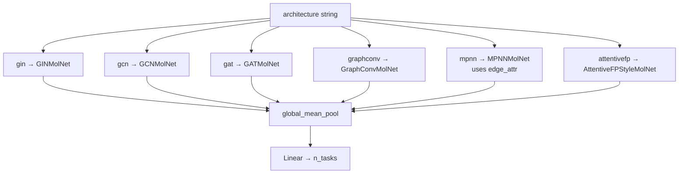
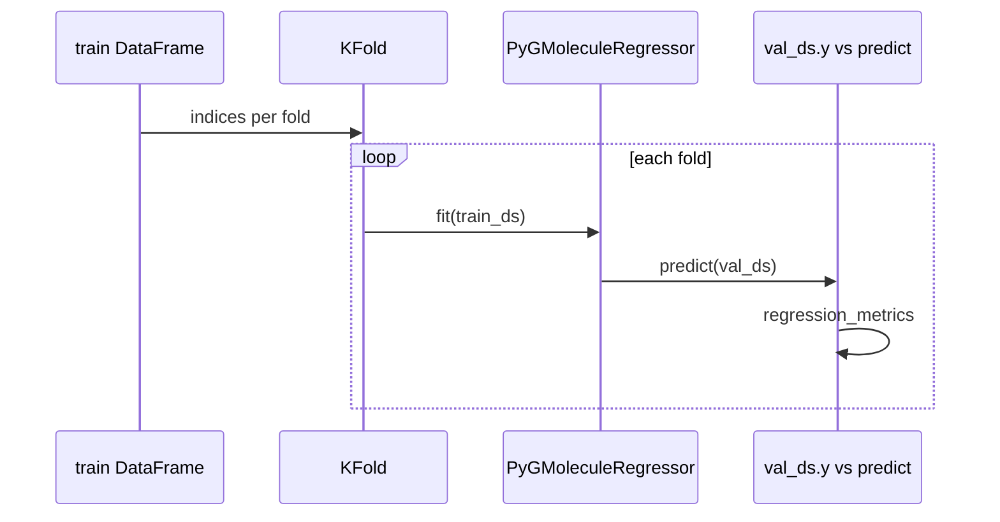

# PyG molecular graph regression

This document describes how **SMILES → PyG graphs → encoders → regression** fits together in OpenADNet, with diagrams and links into the source tree.

**Requirements:** `pip install openadnet[dl]` (PyTorch, PyTorch Geometric, RDKit).

---

## End-to-end pipeline

| Step | Role | Code |
|------|------|------|
| Atom/bond features, `edge_attr` | Fixed featurization dim | [`graph.py`](../src/models/data/graph.py) (`ATOM_FEATURE_DIM`, `EDGE_FEATURE_DIM`, `mol_to_pyg_data`) |
| Dataset + targets | `GraphRegressionDataset`, `.y` property | [`graph.py`](../src/models/data/graph.py) (`GraphRegressionDataset`, `graph_regression_from_dataframe`) |
| Training loop | MSE, Adam, `model(batch)` | [`pyg_regressor.py`](../src/models/nn/pyg_regressor.py) (`PyGMoleculeRegressor`) |
| GIN default API | Thin subclass | [`gnn_regression.py`](../src/models/gnn_regression.py) (`GNNRegressor`) |

---

## Module layout

- **Data:** [`src/models/data/graph.py`](../src/models/data/graph.py)  
- **Encoders:** [`src/models/nn/pyg_architectures.py`](../src/models/nn/pyg_architectures.py)  
- **Factory:** [`src/models/nn/registry.py`](../src/models/nn/registry.py)  
- **Regressor:** [`src/models/nn/pyg_regressor.py`](../src/models/nn/pyg_regressor.py)  
- **Package exports:** [`src/models/nn/__init__.py`](../src/models/nn/__init__.py)  
- **K-fold CV:** [`src/models/cv_dl.py`](../src/models/cv_dl.py) (`run_gnn_regressor_cv`)  
- **Public lazy exports:** [`src/models/__init__.py`](../src/models/__init__.py) (`GNNRegressor`, `PyGMoleculeRegressor`)

---

## Choosing `architecture=...`

| `architecture` | Class | PyG layers | Uses `edge_attr`? |
|----------------|-------|------------|-------------------|
| `gin` | [`GINMolNet`](../src/models/nn/pyg_architectures.py#L27) | `GINConv` × L | No |
| `gcn` | [`GCNMolNet`](../src/models/nn/pyg_architectures.py#L61) | `GCNConv` × L | No |
| `gat` | [`GATMolNet`](../src/models/nn/pyg_architectures.py#L87) | `GATConv` × L (`gat_heads`) | No |
| `graphconv` | [`GraphConvMolNet`](../src/models/nn/pyg_architectures.py#L123) | `GraphConv` × L | No |
| `mpnn` | [`MPNNMolNet`](../src/models/nn/pyg_architectures.py#L151) | `NNConv` × L | **Yes** |
| `attentivefp` | [`AttentiveFPStyleMolNet`](../src/models/nn/pyg_architectures.py#L192) | `GATConv` stack (simplified readout) | No |

Allowed names are listed in [`ARCHITECTURES`](../src/models/nn/registry.py#L16) in [`registry.py`](../src/models/nn/registry.py). Aliases such as `graph_conv` and `attentive_fp` are accepted by [`create_pyg_module`](../src/models/nn/registry.py#L26) where implemented.

---

## K-fold cross-validation

- Implementation: [`run_gnn_regressor_cv`](../src/models/cv_dl.py#L148) in [`cv_dl.py`](../src/models/cv_dl.py)  
- CLI example: [`scripts/cv_gnn_regressor.py`](../scripts/cv_gnn_regressor.py)  
- Quick subset example: [`examples/quick_cv_gnn_subset.py`](../examples/quick_cv_gnn_subset.py)

---

## Notebooks and holdout examples

- Paste-friendly cells: [`notebooks/pyg_gnn_regression.ipynb`](../notebooks/pyg_gnn_regression.ipynb)  
- Single train/val split: [`examples/holdout_regression.py`](../examples/holdout_regression.py) (`--backend gnn`, `--gnn-architecture`)

---

## Molecule-level descriptors as node features

Baseline **per-molecule** fingerprints (same disk cache as sklearn in [`features_data.py`](../src/features_data.py)) can be concatenated to **every atom row** in [`mol_to_pyg_data`](../src/models/data/graph.py). This is **not** the JSON file `outputs/baseline_cv_cache.json` (that file stores CV metrics only).

- Width helper: [`descriptor_dim`](../src/features_data.py)  
- Concat size: [`atom_feature_dim_with_descriptor`](../src/models/data/graph.py)  
- Dataset / DataFrame: `GraphRegressionDataset(..., descriptor_name=...)` and [`graph_regression_from_dataframe`](../src/models/data/graph.py)  
- Regressor: [`PyGMoleculeRegressor(..., descriptor_name=...)`](../src/models/nn/pyg_regressor.py)  
- Notebook-oriented helpers: [`examples/notebook_graph_with_descriptors.py`](../examples/notebook_graph_with_descriptors.py) (add **repo root** to `sys.path` if you `import examples...`, or call the same functions via `models` as in the notebook)

Large fingerprints (e.g. 4096 bits) on every node increase memory; prefer **`morgan_r2_bits_512`** or **`rdkit_phys_props`** for quick runs.

---

## Tests

- Encoder smoke tests: [`tests/test_pyg_architectures.py`](../tests/test_pyg_architectures.py)  
- Dataset / `GNNRegressor` smoke: [`tests/test_dl_smoke.py`](../tests/test_dl_smoke.py)

---

## Checkpoint format

`PyGMoleculeRegressor.save_pretrained` writes `gnn_regression.pt` with keys such as `architecture`, `in_dim`, `edge_dim`, `hidden_dim`, `num_layers`, `gat_heads`, `descriptor_name` (see [`save_pretrained`](../src/models/nn/pyg_regressor.py#L142) / [`load_pretrained`](../src/models/nn/pyg_regressor.py#L159)). Older checkpoints without `architecture` load as **`gin`**; missing `descriptor_name` means **no** extra descriptor channels.
